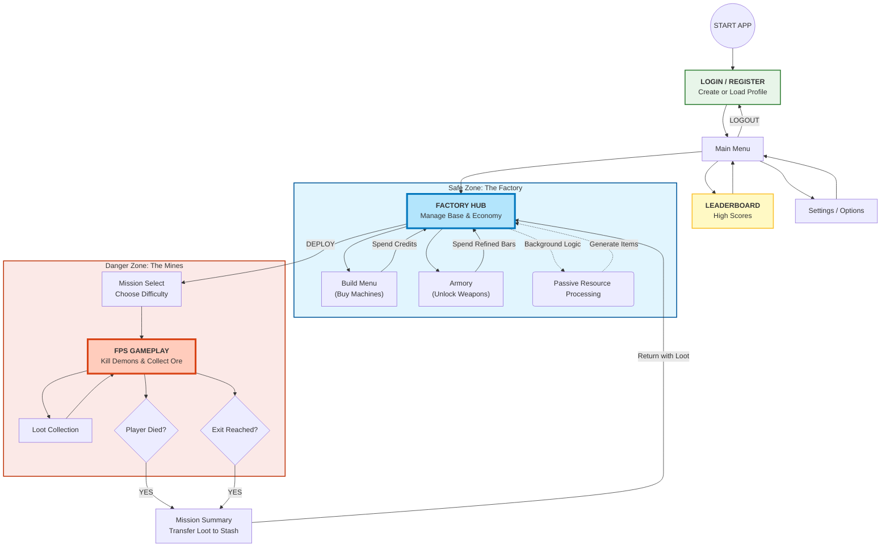
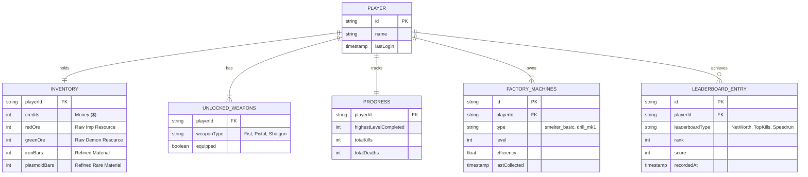

Here is the updated **Phase 2: Game Design & Implementation Plan**.

I have integrated the **Login/Registration** (adapted as Profile/Save Management) and **Leaderboard** into the Screen Descriptions, User Flow, Data Model, and Workload Estimation to strictly meet the assignment requirements.

---

# Phase 2: Game Design & Implementation Plan

## 1. User Screens (Wireframes)

*Note: Visual wireframes to be inserted at `!!!!PLACEHOLDER!!!!` below. Text descriptions of required screens follow:*

### A. Login / Profile Management (State: `login`) [NEW]

* **Purpose:** Meets "Login/Registration" requirement.
* **Visuals:** Industrial security checkpoint aesthetic.
* **Elements:**
* Input Field: "Enter Employee ID (Name)"
* [BUTTON] **PUNCH IN** (Create New Game/Profile)
* List: "Existing Files" (Load Game)


### B. Main Menu (State: `mainMenu`)

* **Visuals:** Retro scanlines, animated logo "INFERNO FACTORY".
* **Elements:**
* [BUTTON] **ENTER FACTORY** (Play)
* [BUTTON] **LEADERBOARD** (View High Scores)
* [BUTTON] **SETTINGS**
* [BUTTON] **LOGOUT** (Back to Profile)


### C. Leaderboard (State: `leaderboard`) [NEW]

* **Purpose:** Meets "Leaderboard" requirement.
* **Visuals:** Digital scoreboard/clipboard style.
* **Elements:**
* **Top Earners:** List of profiles ranked by Total Net Worth.
* **Survivor Records:** List of runs ranked by Kills/Ore.
* [BUTTON] **BACK TO MENU**


### D. Factory Hub (Dashboard) (State: `factory`)

* **Top Bar:** Credits & Resources.
* **Main View:** Grid representation of machines.
* **Bottom UI:** [BUILD] | [ARMORY] | [DEPLOY]

### E. Mission Briefing (State: `levelSelect`)

* Map Preview, Risk Level, Resource Forecast, [START RUN].

### F. Active Gameplay (FPS) (State: `playing`)

* FPS View + Loot Bag HUD.

### G. Post-Run Summary (State: `summary`)

* Mission Outcome, Loot Table, [RETURN TO FACTORY].

!!!!PLACEHOLDER!!!!

---

## 2. User Flow

This diagram illustrates the player journey, including the new Login and Leaderboard loops.



---

## 3. Game Systems Details

### A. The Mining Loop (FPS)

* **Mechanic:** The existing Raycasting engine.
* **Change:** Enemies (Imps, Demons) no longer just drop health/ammo. They drop **Raw Ore**.
* *Imp (Red Enemy):* Drops **Red Ore** (Common).
* *Demon (Green Enemy):* Drops **Green Ore** (Uncommon).
* *Baron (Boss):* Drops **Dark Matter** (Rare).


* **Risk:** If the player dies, they keep only 50% of the ore collected in that run. If they exit via the portal, they keep 100%.

### B. The Factory Loop (Tycoon)

* **Mechanic:** Incremental automation.
* **Process:**
1. **Raw Ore** is stored in the "Silo".
2. **Smelters** (Machine) convert Ore -> Bars over time (e.g., 1 Bar per 5 seconds).
3. **Fabricators** convert Bars -> Credits (Selling) or Ammo (Supply).


* **MVP Rules:**
* Processing happens "instantly" via a click for the MVP, or passively while the game is open in the Hub view.
* *Refinement Ratio:* 2 Raw Ore = 1 Refined Bar.


### C. Progression (Armory)

* Weapons are no longer found on the floor in dungeons. They must be **Fabricated**.
* *Shotgun Unlock:* Requires 50 Red Bars + $1000.
* *Chaingun Unlock:* Requires 20 Green Bars + $5000.


* Once unlocked, the weapon is available in the loadout for all future runs.

---

## 4. Game Economy

### Resources

| Resource | Source | Usage |
| --- | --- | --- |
| **Credits ($)** | Selling Bars, Level Clear Bonus | Buying Machines, repairing Armor. |
| **Red Ore** | Imps (FPS Drop) | Smelting into Iron Bars. |
| **Green Ore** | Demons (FPS Drop) | Smelting into Plasmoid Bars. |
| **Iron Bar** | Smelter (Red Ore) | Unlocking Shotgun, Upgrading Health. |
| **Plasmoid Bar** | Smelter (Green Ore) | Unlocking Chaingun, Upgrading Armor. |

### Costs & Rewards

| Action | Cost | Reward / Outcome |
| --- | --- | --- |
| **Kill Imp** | Ammo | 1-3 Red Ore |
| **Kill Demon** | Ammo | 1-3 Green Ore |
| **Build Smelter** | $500 | Unlocks Ore -> Bar conversion |
| **Sell Iron Bar** | 1 Iron Bar | $10 |
| **Unlock Shotgun** | $2000 + 50 Iron Bars | Permanent Shotgun access |

---

## 5. Data Model (Client-Side Database)

Since this is a React app using `localStorage`, the data model is a JSON object structure. Added `LEADERBOARD` entity.

**Entity Relationship Diagram:**



**JSON Schema (`fps-savegame`):**

```json
{
  "credits": 1500,
  "inventory": {
    "ore_red": 45,
    "ore_green": 12,
    "bar_iron": 5,
    "bar_plasmoid": 0
  },
  "machines": [
    { "id": 1, "type": "smelter_basic", "level": 1 }
  ],
  "unlockedWeapons":, // 1=Fist, 2=Pistol
  "highestLevelCompleted": 3
}

```

---

## 6. API / Functions Design

These are the core TypeScript functions needed to implement the logic, located in `lib/game-logic.ts` or Context providers.

1. **`Economy.ts`**
* `addResource(type: ResourceType, amount: number): void`
* `spendResource(type: ResourceType, amount: number): boolean` (Returns false if insufficient funds).
* `convertOreToBar(oreType: ResourceType): void`


2. **`FactoryManager.ts`**
* `buyMachine(machineType: string): void`
* `calculatePassiveIncome(deltaTime: number): void` (For updating resources while in Hub).


3. **`LootSystem.ts`** (Inside `fps-engine.ts`)
* `generateEnemyLoot(enemyType: EnemyType): Pickup[]`
* `collectLoot(pickup: Pickup): void` (Adds to temporary run inventory).
* `finalizeRun(won: boolean): void` (Transfers temp inventory to permanent storage).


4. **`ProfileSystem.ts`** [NEW]
* `createProfile(name: string): void`
* `saveHighScore(score: number): void`


---

## 7. Task Backlog

Divided into sprints (1 Sprint = approx. 1 week of student work).

### Sprint 1: Economy & Data Structure

* **Task 1.1:** Create `EconomyContext` to manage Credits and Resources.
* **Task 1.2:** Update `localStorage` schema to include inventory and **Player Profiles**.
* **Task 1.3:** Create the **Login/Profile Screen** and **Factory Hub** UI.

### Sprint 2: The Mining Loop (Loot)

* **Task 2.1:** Modify `Enemy` class to carry loot data.
* **Task 2.2:** Create new Sprite assets for "Red Ore" and "Green Ore" pickups.
* **Task 2.3:** Update `HUD` to show "Loot Collected" during gameplay.
* **Task 2.4:** Implement `EndGameSummary` screen to calculate retained loot.

### Sprint 3: Factory Mechanics & Leaderboard

* **Task 3.1:** Implement "Smelting" logic (Click button to convert 5 Ore -> 1 Bar).
* **Task 3.2:** Implement "Market" logic (Click button to Sell Bar -> $).
* **Task 3.3:** Implement "Armory" (Lock weapons in `FPSGame` unless purchased in Hub).
* **Task 3.4:** Implement **Leaderboard UI** reading from local high score array.

---

## 8. Workload Estimation (Person-Hours)

Based on the complexity of the existing `web_game_v0-4-2.txt` code. *Updated to include new required screens.*

| Task Group | Specific Task | Est. Hours | Notes |
| --- | --- | --- | --- |
| **UI Design** | Login & Profile Management | 4h | Basic input and save slot list. |
| **UI Design** | Factory Hub Screen (CSS/React) | 6h | Using existing `retro-border` styles. |
| **UI Design** | Summary/Loot Screen | 4h | Reuse `LevelCompleteScreen`. |
| **UI Design** | Leaderboard Screen | 3h | Simple table sorting logic. |
| **Engine** | Loot Dropping Logic | 5h | Edit `updateEnemyAI` and `checkCollision`. |
| **Assets** | Draw Ore/Bar Sprites | 3h | Pixel art (32x32). |
| **Logic** | Save System/Migration | 4h | Ensure old saves don't crash. |
| **Logic** | Economy System (Context) | 8h | The math behind buying/selling. |
| **Integration** | Connecting Factory to FPS | 6h | Passing data between states. |
| **Testing** | Balancing Costs vs. Drop Rates | 4h | Playtesting. |
| **TOTAL** | **Phase 2 Implementation** | **47h** | ~1.2 weeks full-time. |

---

## 9. Next Steps (Execution)

1. **Setup:** Create the `FactoryContext` to hold the new state.
2. **Visuals:** Design the "Factory Hub" view to replace the direct "Level Select" transition.
3. **Mechanics:** Implement the Ore Drop system in the Raycasting engine first, as that is the source of all economy.